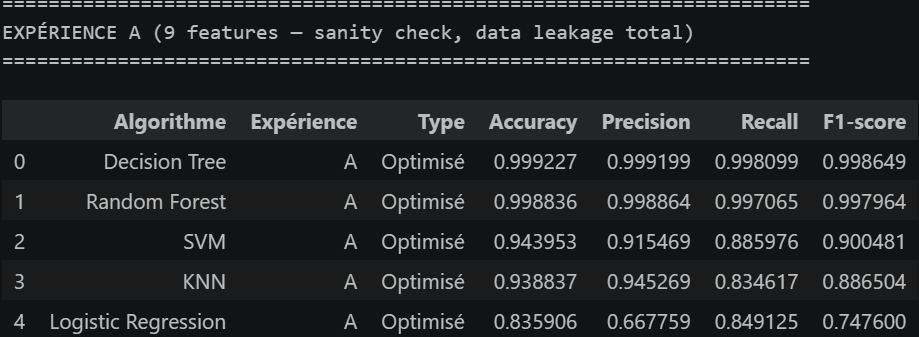
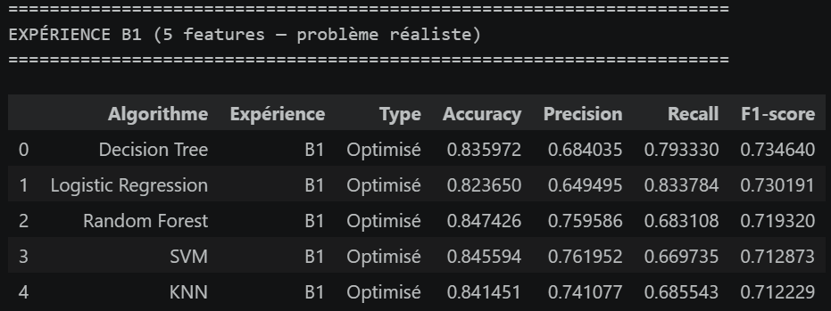

# 🩸 CBC Anomaly Detection — Détection d'anomalies sanguines par Machine Learning

> Projet de Data Mining — Analyse du dataset CBC (Zenodo)
> Détection automatique d'anomalies dans les analyses de numération formule sanguine (NFS/CBC) à partir de 523 844 analyses hospitalières réelles.

---

## 📋 Table des matières

- [Contexte et objectif](#-contexte-et-objectif)
- [Dataset](#-dataset)
- [Structure du projet](#-structure-du-projet)
- [Pipeline du projet](#-pipeline-du-projet)
- [Installation](#-installation)
- [Utilisation](#-utilisation)
- [Résultats](#-résultats)
- [Choix méthodologiques importants](#-choix-méthodologiques-importants)
- [Limites](#-limites)
- [Auteurs](#-auteurs)

---

## 🎯 Contexte et objectif

La **numération formule sanguine (CBC — Complete Blood Count)** est l'examen biologique le plus prescrit en milieu hospitalier. Elle mesure les composants clés du sang : globules rouges, globules blancs, plaquettes et leurs indices dérivés.

**Problème** : analyser manuellement des centaines de milliers de résultats CBC est coûteux, lent et sujet aux erreurs humaines.

**Objectif** : construire un système automatique de détection d'anomalies sanguines par Machine Learning, capable de classer chaque analyse comme **Normale** (0) ou **Anormale** (1), à partir des 9 paramètres CBC disponibles.

**Points originaux de ce projet :**
- Dataset non supervisé → création d'une variable cible par règles médicales pondérées
- Identification et traitement explicite du **data leakage** (2 expériences comparées)
- Comparaison rigoureuse de **5 algorithmes** avec tuning d'hyperparamètres

---

## 📊 Dataset

| Caractéristique | Valeur |
|---|---|
| **Source** | [Zenodo — KL_dataset](https://zenodo.org/records/15674541) |
| **Fichier** | `KL_dataset.xlsx` (43.74 MB) |
| **Période** | Novembre 2019 – Mars 2024 |
| **Lignes** | 523 844 analyses sanguines |
| **Colonnes** | 13 (dont 9 paramètres CBC biologiques) |
| **Valeurs manquantes** | 0 |
| **Doublons** | 0 |

### Paramètres CBC disponibles

| Paramètre | Description | Unité | Poids médical |
|---|---|---|---|
| ERY | Érythrocytes (globules rouges) | ×10¹²/L | 3 (primaire) |
| HK | Hématocrite | % | 1 (secondaire) |
| LEUKO | Leucocytes (globules blancs) | ×10⁹/L | 3 (primaire) |
| HB | Hémoglobine | g/dL | 3 (primaire) |
| PLT | Plaquettes | ×10⁹/L | 3 (primaire) |
| MCV | Volume globulaire moyen | fL | 1 (secondaire) |
| MCHC | Concentration corpusculaire en hémoglobine | g/dL | 1 (secondaire) |
| MCH | Teneur corpusculaire en hémoglobine | pg | 1 (secondaire) |
| RDW | Indice de distribution des GR | % | 1 (secondaire) |

---

## 📁 Structure du projet

```
cbc-anomaly-detection/
│
├── data/
│   ├── raw/
│   │   └── KL_dataset.xlsx              # Dataset brut Zenodo (ne pas modifier)
│   └── processed/
│       ├── cleaned_data.csv             # Après nettoyage + capping outliers
│       ├── labeled_data.csv             # Avec score pondéré + label
│       ├── X_train_A.csv                # Features Expérience A (9 variables)
│       ├── X_test_A.csv
│       ├── y_train_A.csv
│       ├── y_test_A.csv
│       ├── X_train_B1.csv               # Features Expérience B1 (5 variables)
│       ├── X_test_B1.csv
│       ├── y_train_B1.csv
│       ├── y_test_B1.csv
│       ├── results_logreg.csv           # Résultats par algorithme
│       ├── results_knn.csv
│       ├── results_dt.csv
│       ├── results_rf.csv
│       ├── results_svm.csv
│       ├── results_all_models.csv       # Tableau comparatif global
│       └── comparison_A_vs_B1.csv      # Écart data leakage A vs B1
│
├── notebooks/
│   ├── 01_data_understanding.ipynb     # Exploration initiale
│   ├── 02_preprocessing.ipynb          # Nettoyage + outliers
│   ├── 03_labeling.ipynb               # Score pondéré + création du label
│   ├── 04_features_split_scaling.ipynb # Split + normalisation (2 expériences)
│   ├── 05_modeling_logistic_regression.ipynb
│   ├── 06_modeling_knn.ipynb
│   ├── 07_modeling_decision_tree.ipynb
│   ├── 08_modeling_random_forest.ipynb
│   ├── 09_modeling_svm.ipynb
│   └── 10_evaluation_comparaison_finale.ipynb
│
├── src/
│   └── evaluation.py                   # Fonctions réutilisables (evaluate_model, plots)
│
├── models/
│   ├── scaler_A.pkl                    # StandardScaler Expérience A
│   ├── scaler_B1.pkl                   # StandardScaler Expérience B1
│   ├── logreg_A_best.pkl
│   ├── logreg_B1_best.pkl
│   ├── knn_A_best.pkl
│   ├── knn_B1_best.pkl
│   ├── dt_A_best.pkl
│   ├── dt_B1_best.pkl
│   ├── rf_A_best.pkl
│   ├── rf_B1_best.pkl
│   ├── svm_A_best.pkl
│   └── svm_B1_best.pkl
│
├── figures/
│   ├── boxplots_avant_traitement.png
│   ├── distribution_scores.png
│   ├── distribution_classes_finales.png
│   ├── scaling_experience_B1.png
│   ├── confusion_matrices_logreg.png
│   ├── confusion_matrices_knn.png
│   ├── confusion_matrices_dt.png
│   ├── confusion_matrices_rf.png
│   ├── confusion_matrices_svm.png
│   ├── courbes_roc_comparaison.png
│   ├── comparaison_metriques_globale.png
│   └── ecart_A_vs_B1.png
│
├── requirements.txt
└── README.md                           # Ce fichier
```

---

## 🔄 Pipeline du projet

```
┌─────────────────────────────────────────────────────────────────┐
│  1. DATA UNDERSTANDING                                          │
│     523 844 lignes · 9 paramètres CBC · 0 NaN · 0 doublons     │
└────────────────────────┬────────────────────────────────────────┘
                         ↓
┌─────────────────────────────────────────────────────────────────┐
│  2. PREPROCESSING                                               │
│     Suppression colonnes inutiles (SampleNum, PatientNum...)    │
│     Détection outliers IQR → conservation (signal médical)      │
│     Capping valeurs biologiquement impossibles (98 valeurs)     │
└────────────────────────┬────────────────────────────────────────┘
                         ↓
┌─────────────────────────────────────────────────────────────────┐
│  3. FEATURE ENGINEERING — LABELING                              │
│     Score pondéré sur plages médicales normales (max = 17)      │
│     Seuil retenu : weighted_score ≥ 9                           │
│     Distribution : 71.4% Normal / 28.6% Anomalie               │
└────────────────────────┬────────────────────────────────────────┘
                         ↓
┌─────────────────────────────────────────────────────────────────┐
│  4. PRÉPARATION FEATURES — 2 EXPÉRIENCES                        │
│     Expérience A  : X = 9 variables (data leakage total)        │
│     Expérience B1 : X = 5 variables (HK, MCV, MCHC, MCH, RDW)  │
│     Split stratifié 80/20 · StandardScaler (fit sur train)      │
└────────────────────────┬────────────────────────────────────────┘
                         ↓
┌─────────────────────────────────────────────────────────────────┐
│  5. MODÉLISATION — 5 ALGORITHMES × 2 EXPÉRIENCES               │
│     Logistic Regression · KNN · Decision Tree                   │
│     Random Forest · SVM                                         │
│     Baseline → GridSearchCV (F1-score) → Meilleur modèle        │
└────────────────────────┬────────────────────────────────────────┘
                         ↓
┌─────────────────────────────────────────────────────────────────┐
│  6. ÉVALUATION FINALE                                           │
│     Accuracy · Precision · Recall · F1-score · AUC-ROC          │
│     Sélection : F1-score (prioritaire) + Recall (médical)       │
│     Analyse écart A vs B1 (preuve data leakage)                 │
└─────────────────────────────────────────────────────────────────┘
```

---

## ⚙️ Installation

### Prérequis
- Python 3.8+
- Jupyter Notebook ou JupyterLab

### Installation des dépendances

```bash
# Cloner le projet
git clone https://github.com/votre-repo/cbc-anomaly-detection.git
cd cbc-anomaly-detection

# Installer les dépendances
pip install -r requirements.txt
```

### Contenu de `requirements.txt`

```
pandas>=1.5.0
numpy>=1.23.0
scikit-learn>=1.1.0
matplotlib>=3.6.0
seaborn>=0.12.0
joblib>=1.2.0
openpyxl>=3.0.0
jupyter>=1.0.0
```

---

## 🚀 Utilisation

Exécutez les notebooks **dans l'ordre numérique** depuis le dossier `notebooks/` :

```bash
cd notebooks/
jupyter notebook
```

| Notebook | Notes |
|---|---|
| 01_data_understanding | Lecture du fichier .xlsx |
| 02_preprocessing | |
| 03_labeling | |
| 04_features_split_scaling | |
| 05_modeling_logistic_regression | GridSearchCV cv=5 |
| 06_modeling_knn | Sous-échantillon 25K |
| 07_modeling_decision_tree |  |
| 08_modeling_random_forest | GridSearchCV cv=3 |
| 09_modeling_svm | Sous-échantillon 25K |
| 10_evaluation_comparaison_finale | |

> ⚠️ **Important** : les notebooks 06 (KNN) et 09 (SVM) utilisent un sous-échantillon stratifié de 25 000 lignes pour des raisons de complexité computationnelle. Cela est documenté explicitement dans le rapport.

---

## 📈 Résultats

### Distribution des classes (après labeling)

| Classe | Nombre | Proportion |
|---|---|---|
| Normal (0) | 374 143 | 71.4% |
| Anomalie (1) | 149 701 | 28.6% |

### 📊 Comparaison des modèles— (résultat principal)

<p align="center">
  
  
</p>

## 🔬 Choix méthodologiques importants

### 1. Labeling par règles médicales pondérées
Le dataset ne contenant pas de labels explicites, un score pondéré a été construit sur la base des plages de référence cliniques standards :

> *"Since the dataset does not contain explicit labels, we constructed a medically-inspired rule-based labeling strategy using standard CBC reference ranges."*

Les paramètres primaires (ERY, LEUKO, HB, PLT) reçoivent un poids de 3 (détection en première intention), les paramètres secondaires (HK, MCV, MCHC, MCH, RDW) reçoivent un poids de 1 (caractérisation). Le seuil de 9 (sur 17 maximum) a été retenu après comparaison systématique de tous les seuils de 1 à 17.

### 2. Gestion du Data Leakage (2 expériences)
Deux configurations de features ont été comparées pour démontrer et quantifier l'effet du data leakage :

- **Expérience A** (9 features) : test de cohérence du pipeline ML
- **Expérience B1** (5 features) : évaluation réelle de la capacité de généralisation

### 3. Conservation des outliers médicaux
Les valeurs hors bornes IQR n'ont **pas** été supprimées — elles représentent de potentielles vraies anomalies cliniques (leucémies, anémies sévères, thrombopénies), qui constituent précisément le signal d'intérêt à détecter.

### 4. Sous-échantillonnage pour KNN et SVM
La complexité computationnelle de KNN (O(n²) en prédiction) et SVM (O(n²) à O(n³) en entraînement) rend leur application au dataset complet (~419K lignes de train) irréaliste. Un sous-échantillon stratifié de 25 000 lignes a été utilisé pour ces deux algorithmes, en conservant les proportions de classes d'origine.

---

## ⚠️ Limites

1. **Labels synthétiques** : les labels ont été construits par règles médicales et non à partir de diagnostics médicaux réels — ils ne peuvent pas être considérés comme une vérité terrain absolue.

2. **Data leakage résiduel (Expérience B1)** : les 5 variables à poids=1 contribuent quand même au score pondéré ayant servi à construire le label, bien que de façon moins directe que les 4 variables à poids=3.

3. **Contrainte computationnelle** : KNN et SVM ont été entraînés sur un sous-échantillon (25 000 / ~419 000 lignes), ce qui peut limiter leur performance sur le test set complet.

4. **Pas de distinction par type d'anomalie** : le label est binaire (Normal/Anomalie), sans distinction du type d'anomalie (anémie, leucémie, thrombopénie, etc.) — une classification multi-classes serait plus riche médicalement.

---

## 👥 Auteurs

Projet réalisé dans le cadre du module **Data Mining**
Année universitaire **2025 – 2026**